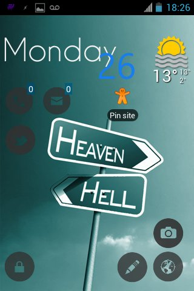

.. title: Tutorial: save GPS location to text with Tasker
.. date: 2012-11-26
.. category: guide
.. tags: android, tasker
.. lang: es
.. slug: tasker-gps-location-to-text

[TOC]

## Background information

I always wanted a way to say "Hey GPS, see this spot here? the one
you're indicating, can you pin it with text so I can retrieve it
later?". All the ways I've found required to install apps. I'm fine with
that but a) install 5MB or more just to get that functionality? I didn't
want to change my notes app nor have another one; b) install 5MB or more in my low memory
android phone just to get that? no thank you.

Time went by, forgot about it as I'm not needing it right now (but it's
nice to have). Installed ICS on my LG Optimus One, expanded the
memory/A2SD, and somehow I found/tried Tasker. Yes, that program that
it's very cool, everyone recommends it, posts the same common examples
that you don't need but you want to use it anyway. Yes, that one. There
are many alternatives, and even free with some limitations. But (people
say) they are not as complete as Tasker.

## Tasker task

Go to the task tab and add a new one:

**Task:** *Location to Txt*

**Actions** for the task:

-   <kbd>File > Write file</kbd>. File: choose which one to open/create. Text:
``%DATE %TIME - %LOC - %TEXTHERE`` . Check "Append" and "Add newline"
-   (optional). <kbd>Alert > Flash</kbd>. Text: *Pinned!* . This creates the info
box that you always see (the black one).

Go to the Scene tab and create a new one.

**Scene:**

The necessary things are: the **TextEdit** (to input a description, you
can skip this if you only want to save the coordinates. If that's the
case, you don't even need the scene) and the **button**. You can add a
text element that shows the coordinates and an image, because images
bring life to the UI.

If you decided to include the text that shows the coordinates, enter the
properties and in Text add *%LOC*

In the TextEdit properties, in the Text Changed tab, add a variable
(<kbd>variable > variable set</kbd>). Name: ``%HERETEXT`` To: ``%new\_val``

The button, in the Tap tab.

-   <kbd>Task > Perform Task</kbd>. Name: *Location to Txt*.
-   <kbd>Scene > Destroy scene</kbd>. (pick the scene you're creating. It should
be defaulted).

Save the changes and go back to the Task tab.

**Task:** *Pin Here*

-   <kbd>Misc. \> GPS \> on</kbd>
-   <kbd>Scene \> Show Scene</kbd>. Name: (Pick the scene you've previously
created). Display As: *Activity, Full Window* (or play and find one
that you like). Check "Show exit button" (optional) and "continue
task immediately"
-   <kbd>Task \> wait</kbd>. MS: *100*. Everything else to 0. This is to show the
keyboard. You can skip this (and the next) if you don't mind
clicking the text box to type.
-   <kbd>Input \> Soft keyboard</kbd>

## Homescreen

The only thing that is left is the shortcut/widget!

Create a <kbd>widget \> task</kbd>. Pick *Pin Here*

Here, here! touch me!

Tap and you get this!

When you tap "save" it saves and shows the black info popup
boxy-box. Here is an example of what the text file could look like:

When you open the link, it shows the waypoint/spot in the map (seems to
only work with Google Maps, unless you change the format, that way it
also works with OsmAnd - from all the maps I've tested-).

## Bugs
Nobody likes bugs but it's Android. If you choose to show the
keyboard when the scene it's shown, it won't close automatically; you
must close it yourself (back button). It's not the script fault nor
Tasker's, but Android's and how it handles things (according to the
developer). Remember that we created a "wait" action? that was to bypass
the "bug" opening the keyboard. This might be necessary for you or not.
This depends on the phone/tablet.
